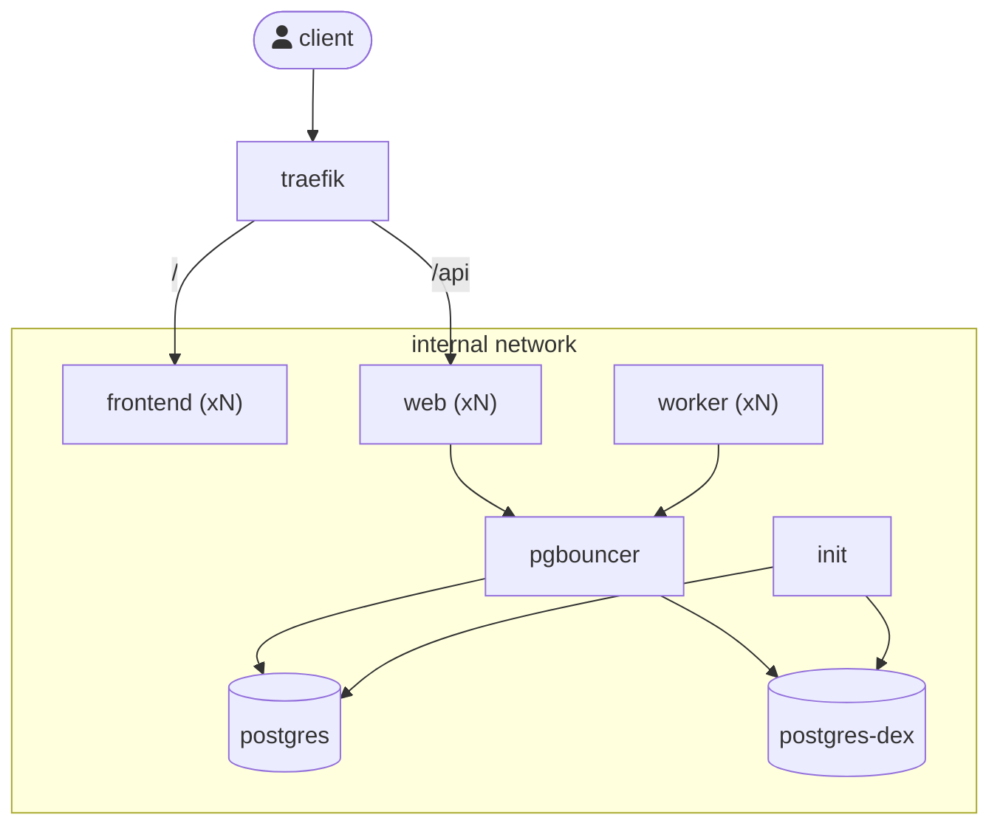

# Scalable Deployment Example

Example of a scalable™️ Dependency-Track deployment.

> [!WARNING]
> **THIS IS ABSOLUTELY INSANELY OVERKILL FOR A SINGLE HOST MACHINE!**

The intention behind this example is **not** for it to be copied 1:1.
In fact almost all aspects of it would be a complete waste of resources
when deployed on a single physical host. Benefits are only to be expected when
services are distributed across multiple physical hosts (or pods).

The idea is to demonstrate what you *can* do, and for you to pick-and-choose
the aspects you find useful. This is not in itself a supported setup,
and you are expected to do your own testing.

## Overview



## Usage

Deploy everything:

```shell
docker compose up -d --pull always
```

Scale `web` containers up to 3 replicas:

```shell
docker compose up -d --scale web=3
```

Scale `web` containers to back down to 1 replica:

```shell
docker compose up -d --scale web=1
```

## Dedicated Init Container

Expensive initialization tasks, such as database migrations, are executed by a dedicated
`init` container. This reduces contention when multiple containers are deployed at once,
and enables other application containers to launch faster. The latter becomes relevant if
you plan on utilizing horizontal auto-scaling.

## Separation of Web and Worker Containers

Application containers are split by responsibility, into "web" and "worker":

"web" containers do not perform any background processing and are meant to solely
handle incoming web traffic. They consume fewer resources when idle and can be horizontally
scaled up and down rather aggressively.

"worker" containers are fully-fledged Dependency-Track instances. They handle background
processing, and even though they *could* handle web traffic, they are not exposed via reverse proxy.

The purpose of this separation is for workloads to not interfere with each other.
For example, high volumes of web traffic could monopolize resources of a container
(CPU, memory, DB connections), causing resource starvation for background processing.

## Separate Postgres Instance for Durable Execution Workload

The durable execution engine (dex) has distinct workload characteristics from the main application.
Isolating it into a separate Postgres instance ensures that neither workload negatively impacts
the other.

While dex is relatively lightweight, it does require frequent vacuuming of queue tables to
remain performant. As your Dependency-Track instance grows, autovacuum can become a challenge
if main application and dex use the same database server.

> [!NOTE]
> This is an optimization that you are *very* unlikely to need. Just know that if you run into
> a scaling ceiling with both workloads mixed, there is an escape hatch here if you need it.

## Centralized Database Connection Pooling

By default, each application container maintains a local connection pool of up to 20-30 connections.
Connections are relatively expensive, because each one requires a separate process on the Postgres server.
As you scale horizontally, the number of connections quickly exceeds what a single Postgres instance can handle efficiently.
In its default configuration, Postgres limits the total number of connections to 100.

[PgBouncer] multiplexes many application connections over a smaller number of actual
database connections, making it a natural fit for deployments with many web and worker
replicas. Note that [PgBouncer] is not your only option, as there are many other similar
connection poolers available.

The downside of course is that a central pooler adds another network hop for every database connection
an application container initiates.

As with every other aspect of this example, do not add a central pooler to your deployment
unless you have solid evidence that database connections are a problem.

[PgBouncer]: https://www.pgbouncer.org/