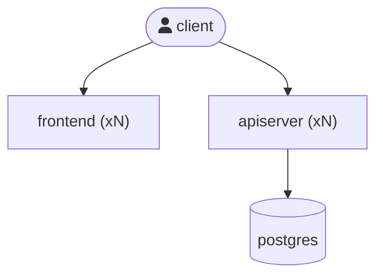

# Simple Deployment Example

## Overview

```mermaid
graph TD
    client([fa:fa-user client])
    frontend["frontend (xN)"]
    apiserver["apiserver (xN)"]
    postgres[(postgres)]
    client --> frontend
    client --> apiserver
    apiserver --> postgres
```